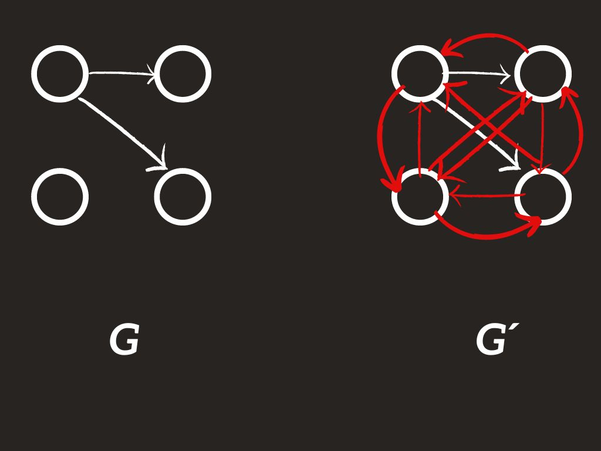
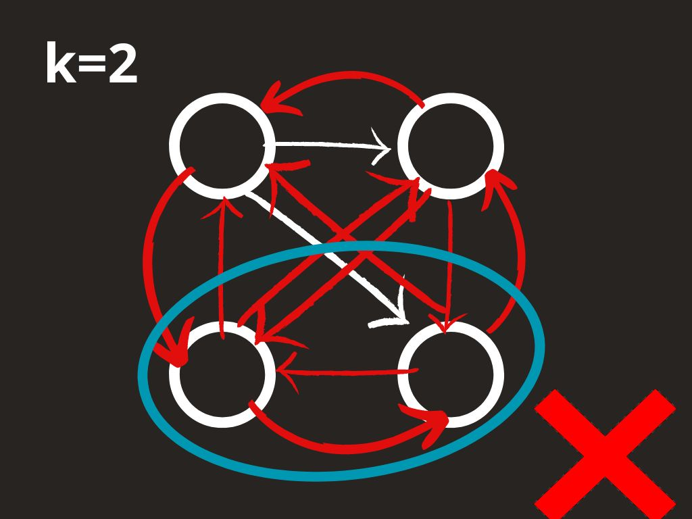
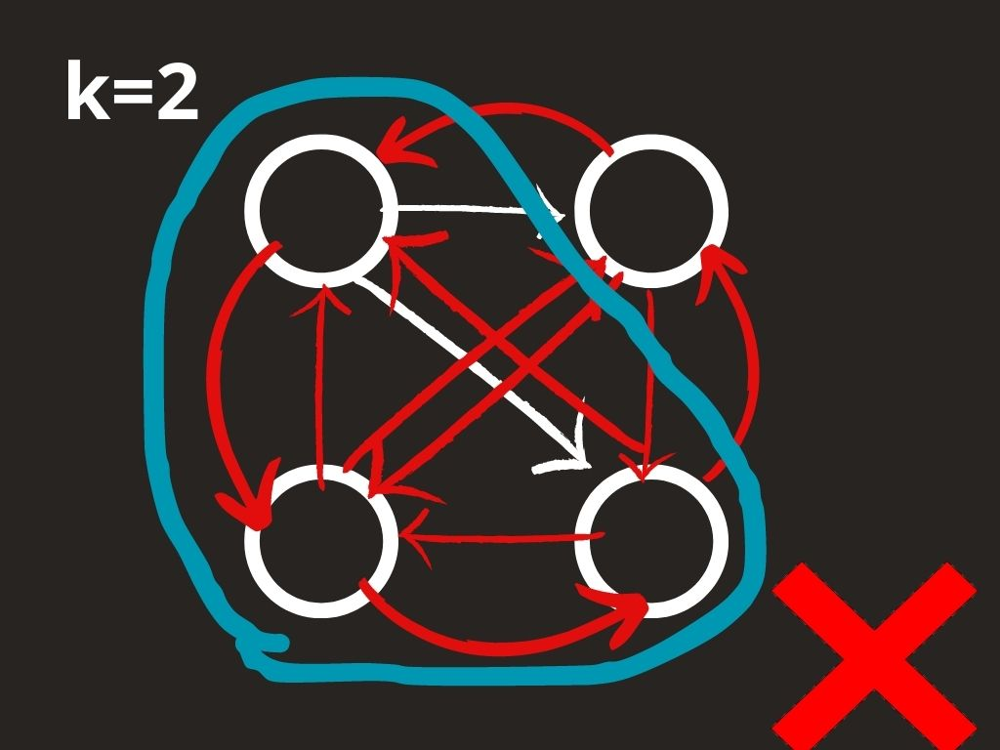
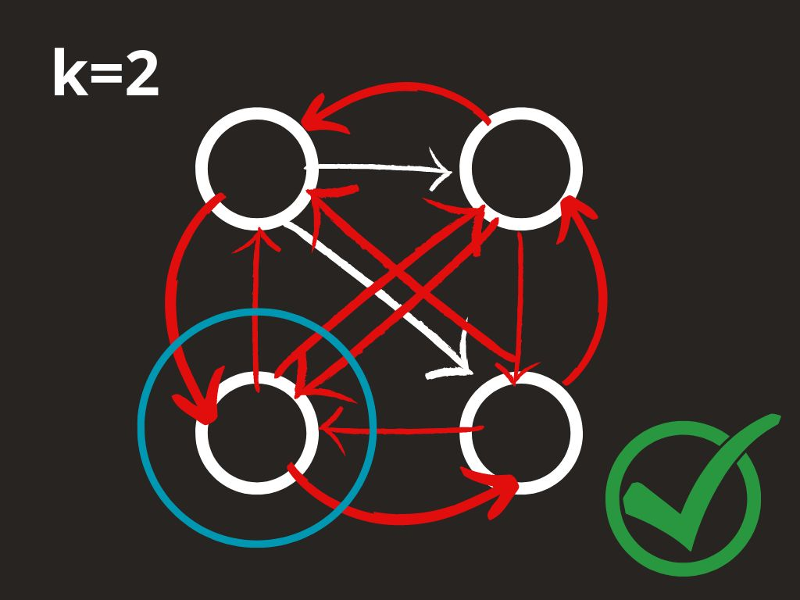
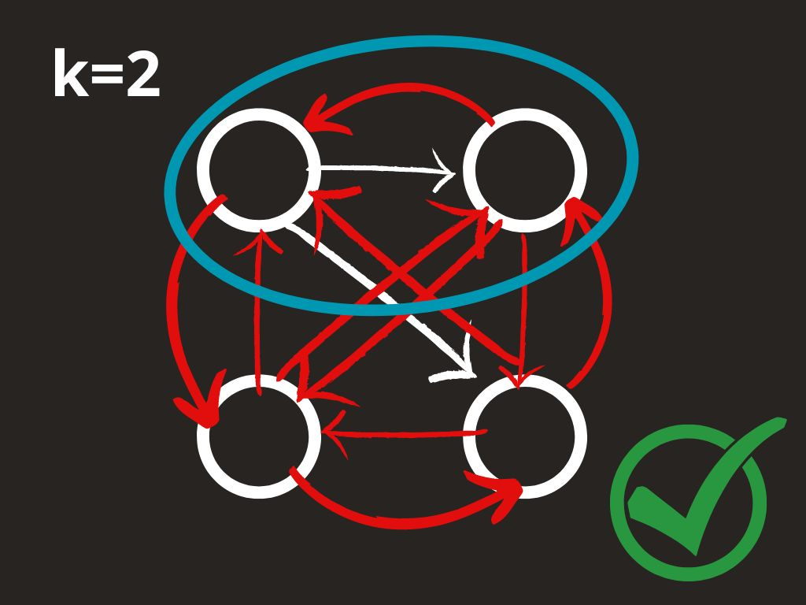

# Tercer Proyecto de DAA
## Integrantes:
- Javier A. Oramas López C-412
- Eduardo García Maleta C-411

# Descripción del Problema

Dado un grafo G tal que `u -> v` implica que `u` piensa mal de `v`.
Se debe encontrar un subgrafo $G_1$ tal que sea lo más grande posible sin sobrepasar los k nodos.

Dicho subgrafo deberá cumplir que:

- si $v \in G_1$, no existe u tal que u -> v y $u \notin G_1$

esto es, si u piensa mal de v, u pertenece al subgrafo para todo v en $G_1$´

# Solucion NP

## Modelación
Para solucionar el problema generamos el grafo G' a partir de G.

G' será un grafo ponderado tal que u->v tiene costo -1 para todas las aristas de G.

Luego para cada nodo $v, v \in G´$, se genera una arista v->w con costo 0 hacia todos los nodos con los que no estaba conectado inicialmente v en G. 

Esto nos da un grafo completo ponderado donde las aristas con costo -1 representan las aristas del grafo inicial.

En la imagen anterior se observa el grafo G inicial y a la derecha el grafo G' con las aristas de costo negativo en blanco y las neutras en rojo.

En este punto el problema se reduce a encontrar un clique en $G_1$ tal que todos los nodos en este clique no tengan aristas con costo -1 provenientes de ningún nodo que no pertenezca al clique.

El problema del clique es uno de los problemas comprobados como NP completos, así que esta solución tendrá una complejidad no polinomial.

## Solución
Dicho esto, no queda otra cosa que iterar por cada uno de los nodos intentando buscar el clique más grande que lo contiene y que no exede los k nodos.

Definimos un array de bool mask tal que si `mask[i] == True`, el nodo pertenece al clique. 
Un backtracking se encarga de revisar todas las posibles soluciones que pueden derivar de tomar el nodo `i` o no tomarlo; guardando el k más alto así como la combinación de nodos seleccionados.

Tomar al nodo i implica también tomar para el clique a todos los nodos con aristas negativas hacia él.

## Ejemplo Ilustrado
  
En la primera imagen se toman los dos nodos inferiores del grafo pero como uno depende de una arista negativa, esta no es una solución válida.

En la segunda imagen se toma la dependencia del nodo y esta sería una distribución válida, pero viola la restricción de no tener mas de k (2 en este ejemplo) nodos. Por tanto, se descarta.

La tercera imagen revisa solo un nodo, que en este caso, no tiene ninguna dependencia, esta es una distribución válida y cumple con la restricción mencionada.

Se actualiza entonces la mejor solución.

No obstante, se puede encontrar, por ejemplo la siguiente selección de nodos, que en este caso, constituyen un subgráfi válido y maximiza la cantidad de nodos, por tanto, se selecciona este sub grafo.

## Complejidad Temporal
Este problema utiliza una solución que está acotada por la solución del Problema del Clique que se encuentra en el capítulo 34.5 `NP-Complete problems` del libro `Introduction to Algorithms, third Edition`. Dicha solución tiene una complejidad de $\Omega (k² \binom{|V|}{k})$

Ahora como en la solución encontrada, a lo sumo revisaremos todos los vertices, como en la solución original podemos afirmar que tendrá una complejidad de $\Omega (k² \binom{|V|}{k})$
# Solución Metaheurística
Para la modelación con una metaheurística se escogió el método de Colonia de Hormigas, principalmente por la capacidad de explorar el espacio de soluciones en un menor tiempo, además los autores han tenido buenos resultados aplicando este algoritmo en otros casos donde se debe seleccionar un grupo de elementos de un grupo más grande.

Se genera un grafo por cada una de las hormigas que se desea crear.
luego estas, seleccionan aleatoriamente un nodo por donde empezar y calculan las probabilidades para cada uno de los nodos.

Luego, sobre cada iteración se van modificando los nodos seleccionados para llegar a una solución óptima.

El proceso de evaluación se realizó multiples veces y no hubo diferencias entre los tamaños de la solución NP y la solución encontrada por la metaheurística. Lo que lleva a pensar que es una solución cuanto menos aceptable.

### NOTA
Es posible encontrarse con grafos en los que no es posible obtener ningun subgrafo que cumpla los requisitos, en cuyo caso, se retorna 0 y una solución vacía

# Ejecución del código

## Requerimientos
El código solo depende de la biblioteca numpy, en caso de no tenerla instalada:
`pip install numpy`
o
`pip install -r requirements.txt` 

## Ejecutar un ejemplo propio
Para ejecutar el algoritmo con un caso pre definido por el usuario se ejecutará el archivo main.py.
Los argumentos deberán introducirse de la siguiente forma:
- lista de personas con las aristas: `id de cada nodo`:`id de los nodos con los que se conecta separados por coma (vacío si no opina de nadie)` 
- valor de k

Por ejemplo para reproducir el ejemplo anterior:

- `python main.py 1:2,3 2: 3: 4: 2`: linea de CMD
- `[{'id': 1, 'edges': [2, 3]}, {'id': 2, 'edges': []}, {'id': 3, 'edges': []}, {'id': 4, 'edges': []}] 2`: Resultado con el que se ejecuta el algoritmo

## Generar tests aleatorios
Para ejecutar el algoritmo con una serie de ejemplos aleatorios se deberá ejecutar

`python test.py`

### NOTA:
Se excluyeron del test los casos que dan como resultado un sub grafo vacío debido a la cantidad de ejemplos que se generaban con esta configuración, si se desea cambiar esto, se deberá añadir el parametro `accept_blank=True` a la llamada de solve en `test.py` o ejecutar con el parámetro `--accept_blank`

- `python test.py --accept_blank`
